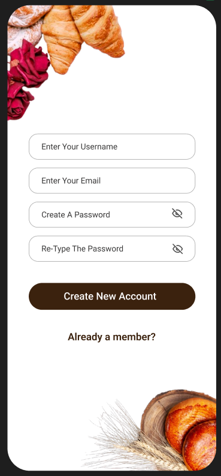
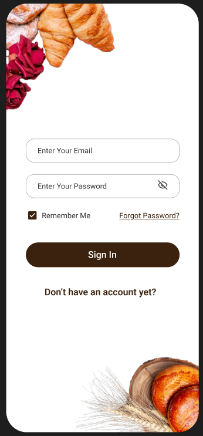
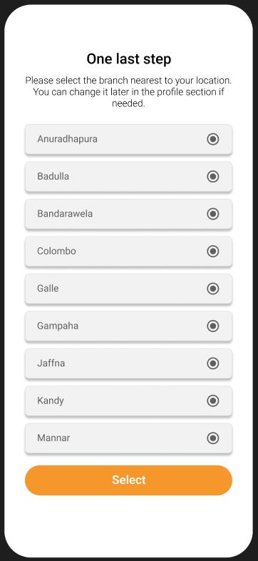
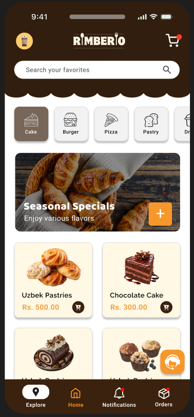
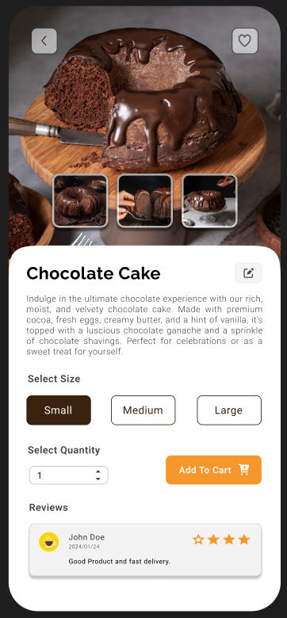
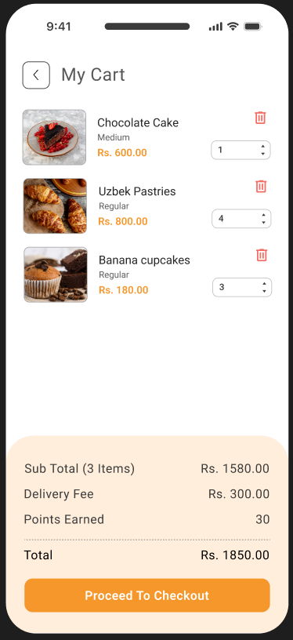
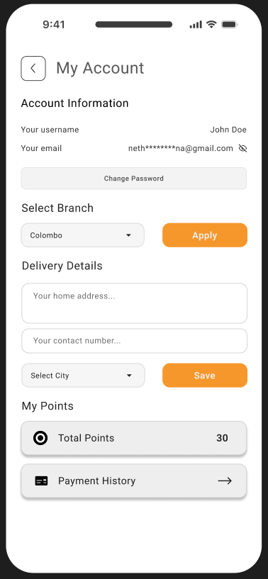
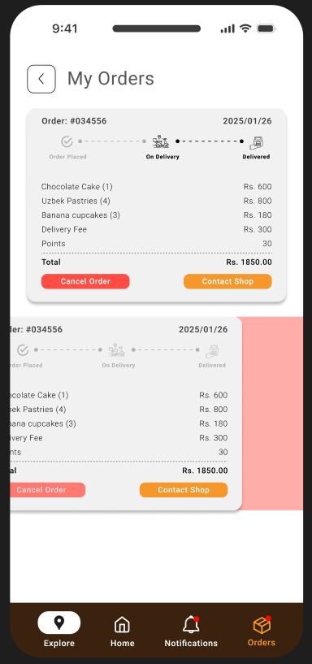
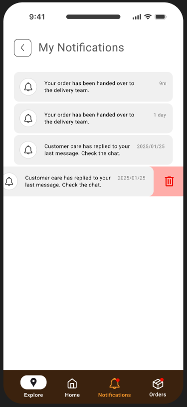
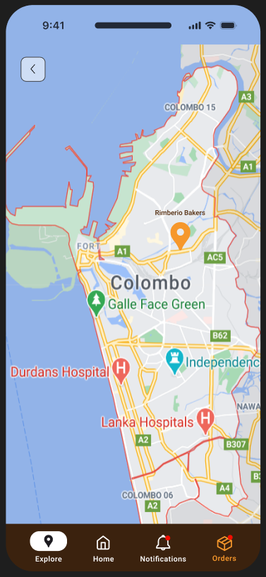

# Rimberio - Bakery Product Selling M-Commerce App 🍰🍞

Rimberio is a **mobile commerce (M-Commerce)** application designed for a seamless bakery product shopping experience. Built with **Java** and **Firebase** (with **SQLite** for local storage), it provides an intuitive and secure platform for purchasing bakery items. The app integrates the **PayHere payment gateway** for a smooth and secure checkout process.

## Features

- **User-Friendly Interface**: Simple and clean design for easy navigation and shopping.
- **Product Catalog**: View and purchase a wide variety of bakery products.
- **Payment Gateway Integration**: Secure payments through the **PayHere** payment gateway.
- **Local Storage**: **SQLite** used in some places for storing local data (such as shopping cart and order history).
- **Firebase Backend**: Real-time database and user data management with Firebase.
- **Order History**: Track past orders and easily reorder your favorite items.

## Tech Stack

- **Android Studio** for front-end development.
- **Java** for the main application logic.
- **Firebase** for backend (Authentication, Database, etc.).
- **SQLite** for local storage (for certain data like shopping cart and history).
- **PayHere** for payment processing.

## 📸 Screenshots

  &nbsp;&nbsp;&nbsp;
  &nbsp;&nbsp;&nbsp;
  &nbsp;&nbsp;&nbsp;
  

  &nbsp;&nbsp;&nbsp;
  &nbsp;&nbsp;&nbsp;
  &nbsp;&nbsp;&nbsp;
  

  &nbsp;&nbsp;&nbsp;
  &nbsp;&nbsp;&nbsp;
  

